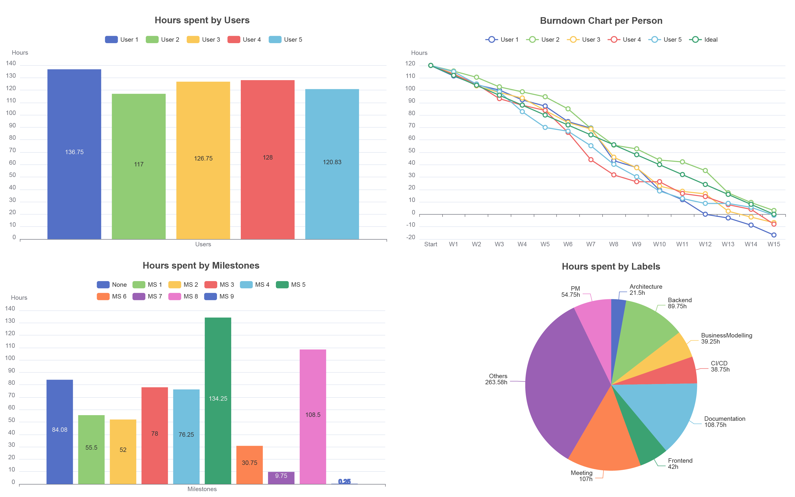
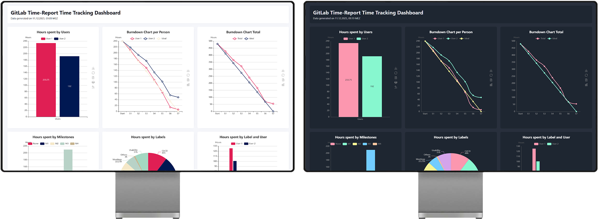

# GitLab Time-Report

[][Latest pipeline]
[][Code coverage report]

GitLab Time-Report is a command-line application that allows you export time logs from Issues and
Merge Requests of a GitLab repository to create statistics and charts of your working hours.
To see a full list of features, run the program with the `--help` argument.

## Contents

[TOC]

## Installation

You can download the latest release build from the releases section.

Alternatively, if you have a Rust toolchain installed, you can install it via Cargo.

```sh
cargo install --git https://gitlab.com/gitlab-time-report/gitlab-time-report
```

## Basic Usage (Print Statistics)

Enter some spent time on your repository by clicking on the "+" next to "Time tracking" in the right sidebar on any Issue or Merge Request.

Run GitLab Time-Report with the URL of your GitLab repository. This will print various tables with statistics about the
logged hours on the repository directly into your console.

```sh
gitlab-time-report-cli https://gitlab.com/username/my-repo
```

Note that if the visibility of the repository is set to "internal" or "private", a GitLab access token is required.
A [personal][Personal access token], [group][Group access token] or [project access token] with the `read_api` permission can be used.

```sh
gitlab-time-report-cli https://gitlab.com/username/my-private-repo --token myAccessToken
```

## Create charts

GitLab Time-Report offers various charts powered by [Apache Echarts].

- Hours per User
- Hours per Milestone
- Hours per Label
- Hours per Type (Issue or Merge Request)
- Hours per Type and User
- Hours per Label and User
- Burndown Chart per User
- Burndown Chart total
- Comparison of estimates and actual time spent per Label

Here is an example with all required arguments for the `charts` command. It will generate all charts as SVG and HTML.
If a PNG is required, open the HTML file and click the "Save to Image" button. To see all arguments you can use for the
charts generation, use `--help` on the subcommand.

```sh
# The Burndown chart will contain 7 sprints of 2 weeks and start at 240 hours remaining per person
gitlab-time-report-cli https://gitlab.com/username/my-repo --token myAccessToken charts --sprints 7 --weeks-per-sprint 2 --hours-per-person 240
```

By default, the charts look like this:



If you would like to change the design of the charts, you can go to the [Apache Echarts Theme Builder Page] and select a theme or create your own. You can then download it as a JSON File. Use the `--theme-json` flag and specify the path to your JSON theme file.

```sh
gitlab-time-report-cli https://gitlab.com/username/my-repo --token myAccessToken charts --theme-json ~/Downloads/chalk.json --sprints 7 --weeks-per-sprint 2 --hours-per-person 120
```

## Create a dashboard

The `dashboard` command creates a dashboard containing the charts above and tables with time statistics. It uses the
same arguments as the `charts` command.

```sh
gitlab-time-report-cli https://gitlab.com/username/my-repo dashboard --sprints 7 --weeks-per-sprint 2 --hours-per-person 240
```

The dashboard is displayed in light or dark mode according to your settings. If you have chosen your own theme, the charts may not be visible perfectly if you use a dark mode theme in light mode or vice versa.



Disclaimer: The dashboards in the screenshots above have themes applied to them.

## Export all time logs

If you wish to export all your time logs for further processing, use the `export` command to create a CSV file.

```sh
# Creates a "timelogs.csv" file in the current directory
gitlab-time-report-cli https://gitlab.com/username/my-repo export
```

## Exclude Labels

If you have many labels on GitLab, you may want to exclude some of them. With `--labels`, you can specify what labels should be
included in your charts and tables. Any labels not in this list will be grouped under "Others". Note that the names of the labels are case-sensitive.

```sh
gitlab-time-report-cli https://gitlab.com/username/my-repo --labels Documentation,"Epic 1" <SUBCOMMANDS>
```

## Validation

GitLab Time-Report also includes a validation for your time logs. By default, only the number of detected problems is
printed to your console. To get a detailed report, run with `--validation-details`.

The validated properties are:

- Excessive hours on a single time log (default: 10 hours, adjustable via `--validation-max-hours`)
- Future date entered
- Entered date before start date (adjustable via `--start-date` on `charts` and `dashboard`)
- No summary entered
- Duplicate entries (Same user, same issue/MR, same date, same summary, same entered time)

## Integration into GitLab CI/CD Pipeline

It is also possible to use GitLab Time-Report inside your pipeline. Here is a simple config that hosts the dashboard on
GitLab Pages. First, create a project access token and create a [CI/CD variable] named `GITLAB_TOKEN`. Then, add the
following to your `.gitlab-ci.yml`:

```yml
gitlab-time-report:
  image: debian:latest
  before_script:
    # Install wget and current root CA certificates to download gitlab-time-report
    - apt-get -qq update && apt-get -qq install ca-certificates wget
  script:
    # Download the latest release of GitLab Time-Report
    - wget --no-verbose -O gitlab-time-report-cli https://gitlab.com/gitlab-time-report/gitlab-time-report/-/releases/permalink/latest/downloads/gitlab-time-report-cli-linux-x86_64-gnu
    - chmod +x gitlab-time-report-cli
    # Creates the dashboard. Make sure to create the GITLAB_TOKEN variable in your repository settings
    - ./gitlab-time-report-cli $CI_PROJECT_URL dashboard --sprints 5 --weeks-per-sprint 3 --hours-per-person 360

pages:
  needs: [ "gitlab-time-report" ]
  pages: true
  script:
    # Create Pages folder if it doesn't exist
    - mkdir -p public
    # Deploy dashboard
    - mv dashboard.html public/dashboard.html
    - echo "Time Tracking Dashboard available on GitLab Pages at $CI_PAGES_URL/dashboard.html"
  rules:
    # Only deploy when pushing to main
    - if: $CI_COMMIT_BRANCH == $CI_DEFAULT_BRANCH
```

### Integrate charts into a Typst document

If you use Typst for the documentation of your project, here is a configuration to automatically include SVGs into
your document. To compile Typst locally, you can use the provided [placeholder images]. They will get overwritten in the pipeline.

```yml
gitlab-time-report:
  image: debian:latest
  before_script:
    # Install wget and current root CA certificates to download gitlab-time-report
    - apt-get -qq update && apt-get -qq install wget ca-certificates
  script:
    # Download the latest release of GitLab Time-Report
    - wget --no-verbose -O gitlab-time-report-cli https://gitlab.com/gitlab-time-report/gitlab-time-report/-/releases/permalink/latest/downloads/gitlab-time-report-cli-linux-x86_64-gnu
    - chmod +x gitlab-time-report-cli
    # Creates the dashboard. Make sure to create the GITLAB_TOKEN variable in your repository settings
    - ./gitlab-time-report-cli $CI_PROJECT_URL dashboard --sprints 5 --weeks-per-sprint 3 --hours-per-person 360

documentation:
  image:
    name: ghcr.io/typst/typst:latest
    entrypoint: [ "" ]
  needs: [ "gitlab-time-report" ]
  script:
    # Move charts into documentation. Make sure to change the path 
    - mv -f charts/*.svg my/image/path
    # Move dashboard into documentation. See Typst snippet below on how to insert it.
    - mv -f dashboard.html my/attachment/path
    - typst compile main.typ
  artifacts:
    paths:
      - main.pdf

pages:
  needs: [ "gitlab-time-report" ]
  pages: true
  script:
    # Create Pages folder if it doesn't exist
    - mkdir -p public
    # Deploy dashboard
    - mv dashboard.html public/dashboard.html
    - echo "Time Tracking Dashboard available on GitLab Pages at $CI_PAGES_URL/dashboard.html"
  rules:
    # Only deploy when pushing to main
    - if: $CI_COMMIT_BRANCH == $CI_DEFAULT_BRANCH
```

It is also possible to include the dashboard in the compiled PDF as an attachment. Include the following line in your
Typst code.

```typ
#pdf.attach(
  "path/to/dashboard.html",
  relationship: "supplement",
  mime-type: "text/html",
  description: "The dashboard containing the worked hours on the project",
)
```

# Background

This application was originally developed as a Studienarbeit (term paper / practical research project) as part of the
Bachelor of Science in Computer Science program at the Eastern Switzerland University of Applied Sciences (OST)
Rapperswil.

The aim of this project was to enhance workflow efficiency by developing a data preparation product using Rust and
GitLab's time tracking feature.
The product intends to assist with time management in the SEProj, SA and BA modules in OSTs computer science curriculum,
but should also be useful to the broader public.

Although GitLab's time tracking is basic, it is functional.
It enables users to provide time estimates and record the actual time spent on each issue and merge request.
However, GitLab does not offer any functions for further processing or preparing this data.
Nevertheless, the data can be obtained via the GitLab API for independent further processing.

To ensure that project planning via GitLab remains a viable alternative for school projects to more complex
products such as Jira or YouTrack, this project aims to bridge the gap between time recording and using data for
planning.

- [Code documentation of the CLI](https://gitlab-time-report-36b2b7.gitlab.io/code-doc/gitlab_time_report_cli/index.html)
- [Code documentation of the library](https://gitlab-time-report-36b2b7.gitlab.io/code-doc/gitlab_time_report/index.html)
- [Code coverage report][]

# Disclaimer

GitLab Time-Report is not associated, endorsed or in any other way related with GitLab, GitLab Inc. or any other related
entities. Usage of the application is subject to the license terms of GPLv3 or later.

This program is free software: you can redistribute it and/or modify it under the terms of the GNU General Public
License as published by the Free Software Foundation, either version 3 of the License, or (at your option) any later
version. This program is distributed in the hope that it will be useful, but WITHOUT ANY WARRANTY; without even the
implied warranty of MERCHANTABILITY or FITNESS FOR A PARTICULAR PURPOSE. See the GNU General Public License for more
details.

[Latest pipeline]: https://gitlab.com/gitlab-time-report/gitlab-time-report/-/pipelines/main/latest

[Code coverage report]: https://gitlab-time-report-36b2b7.gitlab.io/code-coverage/index.html

[Placeholder images]: docs/placeholder_images

[Apache Echarts]: https://github.com/apache/echarts

[Apache Echarts Theme Builder Page]: https://echarts.apache.org/en/theme-builder.html

[Personal access token]: https://docs.gitlab.com/user/profile/personal_access_tokens

[Group access token]: https://docs.gitlab.com/user/group/settings/group_access_tokens/

[Project access token]: https://docs.gitlab.com/user/project/settings/project_access_tokens/

[CI/CD variable]: https://docs.gitlab.com/ci/variables/#for-a-project
